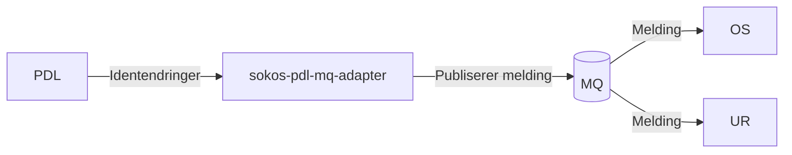

# sokos-pdl-mq-adapter

* [1. Dokumentasjon](dokumentasjon/dokumentasjon.md)
* [2. Funksjonelle krav](#2-funksjonelle-krav)
* [3. Utviklingsmiljø](#3-utviklingsmiljø)
* [4. Programvarearkitektur](#4-programvarearkitektur)
* [5. Deployment](#5-deployment)
* [6. Autentisering](#6-autentisering)
* [7. Drift og støtte](#7-drift-og-støtte)
* [8. Henvendelser](#8-henvendelser)

---

# 2. Funksjonelle Krav

Applikasjonen lytter på identendringer i PDL og sender melding til MQ når det skjer en endring til OS og UR.

# 3. Utviklingsmiljø

### Forutsetninger

* Java 25
* [Gradle](https://gradle.org/)
* [Kotest IntelliJ Plugin](https://plugins.jetbrains.com/plugin/14080-kotest)

### Bygge prosjekt

`./gradlew build installDist`

### Lokal utvikling


# 4. Programvarearkitektur



# 5. Deployment

Distribusjon av tjenesten er gjort med bruk av Github Actions.
[sokos-pdl-mq-adapter CI / CD](https://github.com/navikt/sokos-pdl-mq-adapter/actions)

Push/merge til main branche vil teste, bygge og deploye til produksjonsmiljø og testmiljø.

# 6. Autentisering

Applikasjonen har ingen endepunkter og trenger derfor ingen autentisering men tilganger styres gjennom brukernavn/passord og sertifikater for å koble til PDL og MQ.

# 7. Drift og støtte

### Logging

Feilmeldinger og infomeldinger som ikke innheholder sensitive data logges til [Grafana Loki](https://docs.nais.io/observability/logging/#grafana-loki).  
Sensitive meldinger logges til [Team Logs](https://doc.nais.io/observability/logging/how-to/team-logs/).

### Kubectl

For dev-gcp:

```shell script
kubectl config use-context dev-gcp
kubectl get pods -n okonomi | grep sokos-pdl-mq-adapter
kubectl logs -f sokos-pdl-mq-adapter-<POD-ID> --namespace okonomi -c sokos-pdl-mq-adapter
```

For prod-gcp:

```shell script
kubectl config use-context prod-gcp
kubectl get pods -n okonomi | grep sokos-pdl-mq-adapter
kubectl logs -f sokos-pdl-mq-adapter-<POD-ID> --namespace okonomi -c sokos-pdl-mq-adapter
```

### Alarmer

Applikasjonen bruker [Grafana Alerting](https://grafana.nav.cloud.nais.io/alerting/) for overvåkning og varsling.

Varsler blir sendt til følgende Slack-kanaler:

- Dev-miljø: [#team-mob-alerts-dev](https://nav-it.slack.com/archives/C042SF2FEQM)
- Prod-miljø: [#team-mob-alerts-prod](https://nav-it.slack.com/archives/C042ESY71GX)

### Grafana

- [appavn](url)

---

# 8. Henvendelser

Spørsmål knyttet til koden eller prosjektet kan stilles som issues her på Github.
Interne henvendelser kan sendes via Slack i kanalen [#utbetaling](https://nav-it.slack.com/archives/CKZADNFBP)

